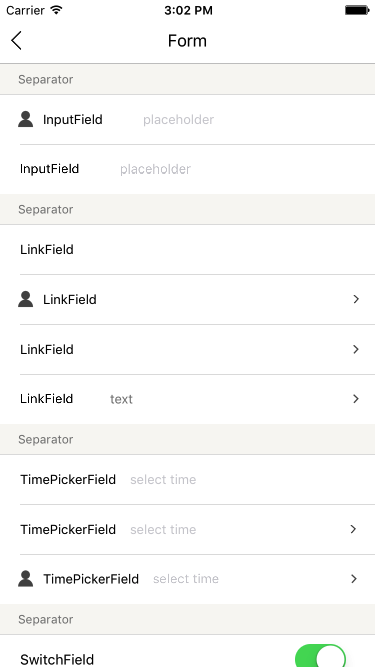
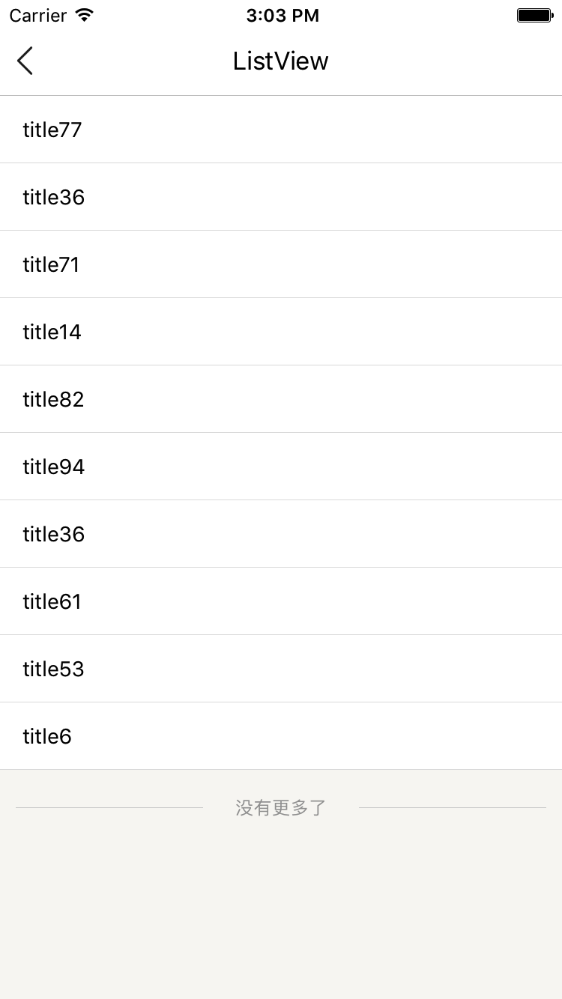
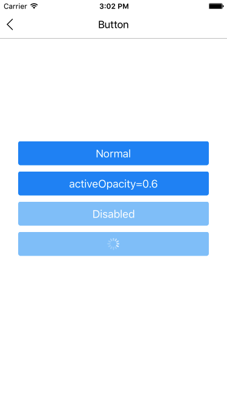
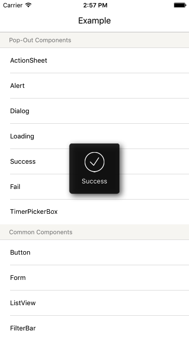
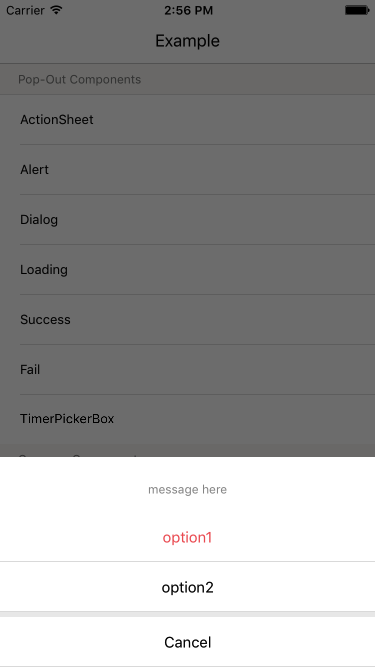
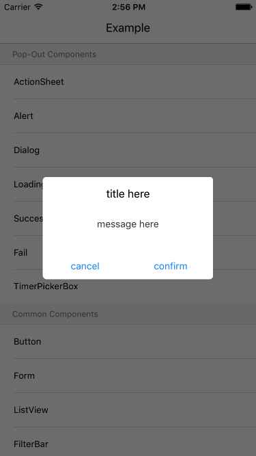
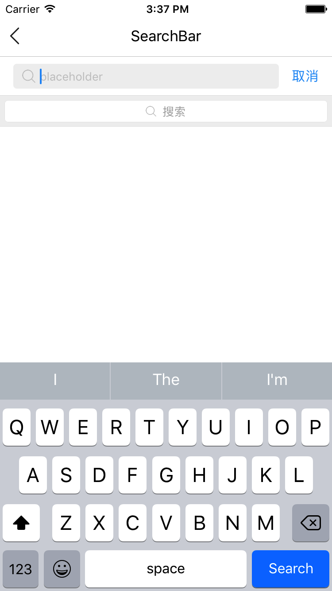
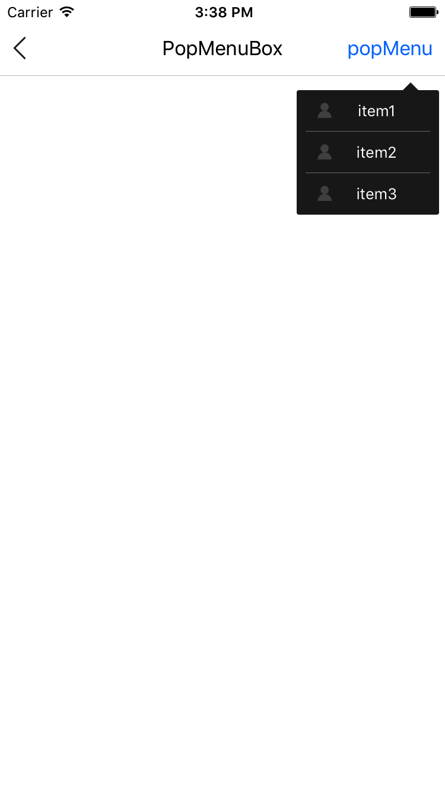
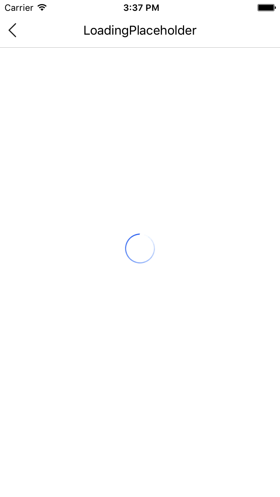

# react-native-wxui
A UI package for React Native , both available on iOS and Android
#Intallation
> npm i react-native-wxui --save

# Usage : Check the included example for more options.

* [Form](#Form)
* [ListView](#ListView)
* [Button](#Button)
* [Loading](#Loading)
* [Success](#Success)
* [Fail](#Fail)
* [ActionSheet](#ActionSheet)
* [Alert](#Alert)
* [Dialog](#Dialog)
* [SearchBar](#SearchBar)
* [PopMenuBox](#PopMenuBox)
* [LoadingPlaceholder](#LoadingPlaceholder)
* [TimePickerBox](#TimePickerBox)
* [FilterBar](#FilterBar)

<a id="Form"></a>
## Form



```javascript
import { Form } from 'react-native-wxui';
class extends Component {
  //...
  _handleChange = (formData, fieldRef) => {
        //formData: {
        //  ref: value
        //}
        console.log('FormData: ', formData);
        console.log(fieldRef + ' has changed');
  }
  //...
  render() {
    return (
            <ScrollView style={styles.container}>
                <Form.Form onFieldChange={this._handleChange}>
                    <Form.Separator label="Separator" />
                    <Form.InputField label="InputField" ref="InputField1"
                        placeholder="placeholder"
                        iconLeft={
                            <Image source={require('./icon.png')} style={styles.iconLeft} />
                        }
                    />
                </Form.Form>
             </ScrollView>
  }
}
```


---

<a id="ListView"></a>
## ListView



```javascript
import { Form } from 'react-native-wxui';
class extends Component {

    //...

    _onFetch = (page = 1, callback, options) => {
        setTimeout(() => {
            let data = [];
            for (var i = 0; i < 10; i++) {
                data.push('title' + (Math.random()*100).toFixed(0));
            }
            callback(data, {
                allLoaded: true,
            })
        }, 2000)
    }

    _renderRow = (rowData, sectionID, rowID, highlightRow) => {
        return (
            <View style={styles.rowContainer}>
                <Text style={{marginLeft: 15}}>{rowData}</Text>
            </View>
        )
    }

    render() {
        return (
            <ListView
                ref={listView => this.listView = listView}
                renderRow={this._renderRow}
                fetchData={this._onFetch}
                pagination={true}
                refreshable={true}
                autoLoad={true} 
                style={styles.container}/>
        )
    }
}
```

---

<a id="Button"></a>
## Button



Usage:
```
<Button style={{backgroundColor: 'red'}} textStyle={{fontSize: 18}}>
  Hello!
</Button>
```
inline：

```
<Button style={{backgroundColor: 'blue'}}>
  <View style={styles.nestedViewStyle}>
    <Text style={styles.nestedTextStyle}>Nested views!</Text>
  </View>
</Button>
```

## API

| Prop | Type | Description |
|------|------|-------------|
| ``onPress`` | ``func`` | Function to execute when the ``onPress`` event is triggered. |
| ``onPressIn`` | ``func`` | Function to execute when the ``onPressIn`` event is triggered. |
| ``onPressOut`` | ``func`` | Function to execute when the ``onPressOut`` event is triggered. |
| ``onLongPress`` | ``func`` | Function to execute when the ``onLongPress`` event is triggered. |
| ``textStyle`` | ``TextStylePropTypes`` | The StyleSheet to apply to the inner button text. |
| ``disabledStyle`` | ``TextStylePropTypes`` | The StyleSheet to apply when disabled. |
| ``children`` | ``string``, ``number``, ``React.Element``,or ``array`` | The child nodes to render inside the button. If child is ``string`` or ``number``, it will be rendered inside of a ``<Text>`` element with ``textStyle`` applied if present. Multiple children are allowed (``array``).|
| ``isLoading`` | ``bool`` | Renders an inactive state dimmed button with a spinner if ``true``. |
| ``isDisabled`` | ``bool`` | Renders an inactive state dimmed button if ``true``. |
| ``activeOpacity`` | ``Number`` | The button onpressing transparency (Usually with a point value between 0 and 1). |
| ``activityIndicatorColor`` | ``string`` | Sets the button of the ``ActivityIndicatorIOS`` or ``ProgressBarAndroid`` in the loading state. |
| ``background`` | ``TouchableNativeFeedback.propTypes.background`` | **Android only**. The background prop of ``TouchableNativeFeedback``. |

## API

| Prop | Type | Description |
|------|------|-------------|
| ``onPress`` | ``func`` | ``onPress``事件被触发时执行的方法 |
| ``onPressIn`` | ``func`` | `onPressIn`事件被触发时执行的方法 |
| ``onPressOut`` | ``func`` | `onPressOut`事件被触发时执行的方法` |
| ``onLongPress`` | ``func`` | ``onLongPress``事件被触发时执行的方法|
| ``textStyle`` | ``TextStylePropTypes`` | 应用在按钮文本的样式 |
| ``disabledStyle`` | ``TextStylePropTypes`` | 按钮被禁用时的样式 |
| ``children`` | ``string``, ``number``, ``React.Element``,or ``array`` | 渲染在button里面的子节点.如果子是`string`或者`number`,如果它是不隐藏的，那么它会被渲染在`<Text>`元素里面并且应用`textStyle`，多节点是允许`array`的|
| ``isLoading`` | ``bool`` | 渲染一个“`菊花`”如果这个属性是true|
| ``isDisabled`` | ``bool`` | 按钮变暗如果这个属性是true |
| ``activeOpacity`` | ``Number`` | 按钮按下去时候的透明度 |
| ``activityIndicatorColor`` | ``string`` | 设置“`菊花`”的颜色 |
| ``background`` | ``TouchableNativeFeedback.propTypes.background`` | **仅限安卓**.  ``TouchableNativeFeedback``的背景属性. |


---------
<a id="Loading"></a>
## Loading


```javascript
import { ProgressHUD } from 'react-native-wxui';
class extends Component {
    //...
    _showLoading = () => {
        ProgressHUD.showLoading('Loading');
        setTimeout(ProgressHUD.hideLoading, 1000);
    }
    //...
}
```

-------

<a id="Success"></a>
## Success



```javascript
import { ProgressHUD } from 'react-native-wxui';
class extends Component {
    //...
    _showSuccess = () => {
        ProgressHUD.showSuccess('Success');
    }
    //...
}
```

-------

<a id="Fail"></a>
## Fail


```javascript
import { ProgressHUD } from 'react-native-wxui';
class extends Component {
    //...
    _showFail = () => {
        ProgressHUD.showFail('Fail');
    }
    //...
}
```

-------

<a id="ActionSheet"></a>
## ActionSheet



```javascript
import { showActionSheet } from 'react-native-wxui';
class extends Component {
    //...
    _showActionSheet = () => showActionSheet({
        buttons: ['option1', 'option2', 'Cancel'],
        highlightedIndex: 0, //set index to -1 for none highligeted
        message: 'message here'
    }, (index) => {
        console.log('index ' + index + ' pressed');
    })
    //...
}
```

-------

<a id="Alert"></a>
## Alert



```javascript
import { showAlert } from 'react-native-wxui';
class extends Component {
    //...
    _showAlert = () => showAlert({
        title: 'title here',
        message: 'message here'
    }, () => {
        console.log('confirmed')
    }, () => {
        console.log('canceled')
    })
    //...
}
```

-------

<a id="Dialog"></a>
## Dialog


```javascript
import { showDialog } from 'react-native-wxui';
class extends Component {
    //...
    _showDialog = () => showDialog({
        title: 'title here',
        message: 'message here'
    }, (text) => {
        console.log('confirmed: ' + text)
    }, () => {
        console.log('canceled')
    })
    //...
}
```

-------

<a id="SearchBar"></a>
## SearchBar



```javascript
import { SearchBar } from 'react-native-wxui';
        <SearchBar
            autoFocus={true}
            placeholder="placeholder"
            value={this.state.text}
            onChange={(event) => {
                if (this.state.text === event.nativeEvent.text) return;
                this.setState({ text: event.nativeEvent.text });
            }} />
        <SearchBar
            editable={true}
            fullWidth={true}
            onPress={() => {
                console.log('SearchBar Pressed')
            }} />
```

-------

<a id="PopMenuBox"></a>
## PopMenuBox



```javascript
import { PopMenuBox } from 'react-native-wxui';


        showPopMenuBox({
                    buttons: buttons
                },
                    (index) => {
                        console.log(index);
                    })
```

-------

<a id="LoadingPlaceholder"></a>
## LoadingPlaceholder



```javascript
import { LoadingPlaceholder } from 'react-native-wxui';


    render() {
        return (
            <View style={styles.container}>
                <LoadingPlaceholder/>
            </View>
        )
    }


```

-------

<a id="TimePickerBox"></a>
## TimePickerBox


```javascript
import { TimePickerBox } from 'react-native-wxui';


        showTimePickerBox('', (date, time) => {
            console.log(date, time)
        }, () => {
            console.log('timePickerBox canceled')
        })

    
```

-------

<a id="TimePickerBox"></a>
## TimePickerBox


```javascript
import { TimePickerBox } from 'react-native-wxui';

const conditions = [
    { options: ['option1', 'option2', 'option3', 'option4', 'option5'], imageSource: require('./icon.png'), imageSelectedSource: require('./icon.png') },
    { options: ['option1', 'option2', 'option3', 'option4', 'option5'], imageSource: require('./icon.png'), imageSelectedSource: require('./icon.png') },
    { options: ['option1', 'option2', 'option3', 'option4', 'option5'], imageSource: require('./icon.png'), imageSelectedSource: require('./icon.png') }
];


  render() {
        return (
            <View style={styles.container}>
                <FilterBar conditions={conditions} onFilterChange={filters => {
                    this.setState({ filters })
                }} />
            </View>
        )
    }
        

    
```